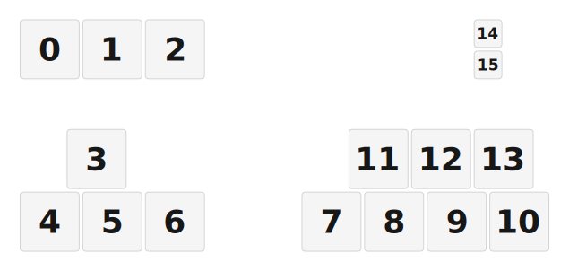

# ZMK Configuration for whn_ff

*Generated by Shield Wizard for ZMK*



Download compiled firmware from the Actions tab. <https://zmk.dev/docs/user-setup#installing-the-firmware>

Edit your keymap <https://zmk.dev/docs/keymaps>.
User keymap is located at [`config/whn_ff.keymap`](config/whn_ff.keymap).

-----

<details>
<summary>
Shield Wizard Debug Information
</summary>

In case of broken configuration, here is the Shield Wizard internal data used to generate this configuration:

Commit: 5840d41ac0915092c8fe45da617ffb4bb91e1b97

```json
{"name":"whn_ff","shield":"whn_ff","dongle":true,"modules":[],"layout":[{"id":"01KM0KCJJXPY5AXHNAJDK8W7GQ","part":0,"row":0,"col":0,"w":1,"h":1,"x":0,"y":0,"r":0,"rx":0,"ry":0},{"id":"01KM0KCJJXAEWRRYXQKM0KSYMH","part":0,"row":0,"col":1,"w":1,"h":1,"x":1,"y":0,"r":0,"rx":0,"ry":0},{"id":"01KM0KCJJX4SEGKVA56D7S902N","part":0,"row":0,"col":2,"w":1,"h":1,"x":2,"y":0,"r":0,"rx":0,"ry":0},{"id":"01KM0KCJJX2NF79VGQXGYBFC2C","part":0,"row":0,"col":8,"w":1,"h":1,"x":3,"y":1,"r":0,"rx":0,"ry":0},{"id":"01KM0KCJJX7VS5VNBYT1M5TQBJ","part":0,"row":1,"col":8,"w":1,"h":1,"x":3,"y":2,"r":0,"rx":0,"ry":0},{"id":"01KM0KCJJXJM3C3PKZYHPF851H","part":0,"row":3,"col":1,"w":1,"h":1,"x":3,"y":0,"r":0,"rx":0,"ry":0},{"id":"01KM0KCJJXNFKRQ96BD8V759SH","part":0,"row":3,"col":5,"w":1,"h":1,"x":0,"y":2,"r":0,"rx":0,"ry":0},{"id":"01KM0KCJJXBV2JKT10MYTPB0J1","part":0,"row":3,"col":6,"w":1,"h":1,"x":1,"y":2,"r":0,"rx":0,"ry":0},{"id":"01KM0KCJJXHPS48D9VCD8VKMVF","part":0,"row":3,"col":7,"w":1,"h":1,"x":2,"y":3,"r":0,"rx":0,"ry":0},{"id":"01KM0KCJJXJAE4W2AF857AWBT0","part":0,"row":4,"col":0,"w":1,"h":1,"x":0,"y":1,"r":0,"rx":0,"ry":0},{"id":"01KM0KCJJX05M7AJTVBZ8FTT6X","part":0,"row":4,"col":1,"w":1,"h":1,"x":1,"y":1,"r":0,"rx":0,"ry":0},{"id":"01KM0KCJJXK5N5DFFM3H5830HV","part":0,"row":4,"col":2,"w":1,"h":1,"x":2,"y":1,"r":0,"rx":0,"ry":0},{"id":"01KM0KCJJXWZ532EX5NEC5VHER","part":0,"row":4,"col":5,"w":1,"h":1,"x":0,"y":3,"r":0,"rx":0,"ry":0},{"id":"01KM0KCJJXEB227ACEHBJYAA79","part":0,"row":4,"col":6,"w":1,"h":1,"x":1,"y":3,"r":0,"rx":0,"ry":0},{"id":"01KM0KCJJXDQRFHC5B5TMQFAVZ","part":0,"row":4,"col":7,"w":1,"h":1,"x":2,"y":2,"r":0,"rx":0,"ry":0},{"id":"01KM0KCJJXT5PV1MA9XH55E7X0","part":0,"row":4,"col":8,"w":1,"h":1,"x":3,"y":3,"r":0,"rx":0,"ry":0}],"parts":[{"name":"unibody","controller":"nice_nano_v2","wiring":"direct_gnd","keys":{"01KM0KCJJX2NF79VGQXGYBFC2C":{"input":"d4"},"01KM0KCJJX7VS5VNBYT1M5TQBJ":{"input":"d5"},"01KM0KCJJXT5PV1MA9XH55E7X0":{"input":"d6"},"01KM0KCJJXHPS48D9VCD8VKMVF":{"input":"d7"},"01KM0KCJJXNFKRQ96BD8V759SH":{"input":"d9"},"01KM0KCJJXEB227ACEHBJYAA79":{"input":"p101"},"01KM0KCJJXDQRFHC5B5TMQFAVZ":{"input":"p102"},"01KM0KCJJXWZ532EX5NEC5VHER":{"input":"p107"},"01KM0KCJJXJAE4W2AF857AWBT0":{"input":"d10"},"01KM0KCJJX05M7AJTVBZ8FTT6X":{"input":"d16"},"01KM0KCJJXK5N5DFFM3H5830HV":{"input":"d14"},"01KM0KCJJXJM3C3PKZYHPF851H":{"input":"d15"},"01KM0KCJJX4SEGKVA56D7S902N":{"input":"d18"},"01KM0KCJJXAEWRRYXQKM0KSYMH":{"input":"d19"},"01KM0KCJJXPY5AXHNAJDK8W7GQ":{"input":"d20"},"01KM0KCJJXBV2JKT10MYTPB0J1":{"input":"d8"}},"encoders":[],"pins":{"d2":"bus","d3":"bus","d4":"input","d5":"input","d6":"input","d7":"input","p101":"input","p102":"input","p107":"input","d10":"input","d16":"input","d14":"input","d15":"input","d18":"input","d19":"input","d20":"input","d9":"input","d8":"input"},"buses":[{"type":"spi","name":"spi0","devices":[]},{"type":"spi","name":"spi1","devices":[]},{"type":"spi","name":"spi2","devices":[]},{"type":"spi","name":"spi3","devices":[]},{"type":"i2c","name":"i2c0","devices":[{"type":"ssd1306","add":60,"width":128,"height":64}],"sda":"d2","scl":"d3"},{"type":"i2c","name":"i2c1","devices":[]}]}]}
```

</details>
